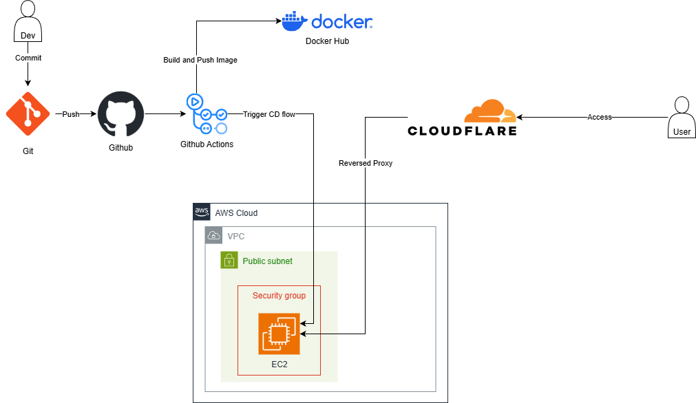

# Answer

## System Architecture

## Description
- AWS:
    - Create a **VPC**.
    - Create a **subnet**.
    - Create a **security group**.
    - Create **EC2 instance**.
- Github:
    - Create **CI.yml** to build image from source code, push to Docker Hub, and test automatically.
    - Create **CD.yml** to deploy to EC2 automaicall after CI completed.
- CloudFlare:
    - Install **cloudflare tunnel** on EC2.
    - Create a Self-host application to reversed proxy to EC2.
## Access through

https://gos-challenge.benjaminluong.id.vn/